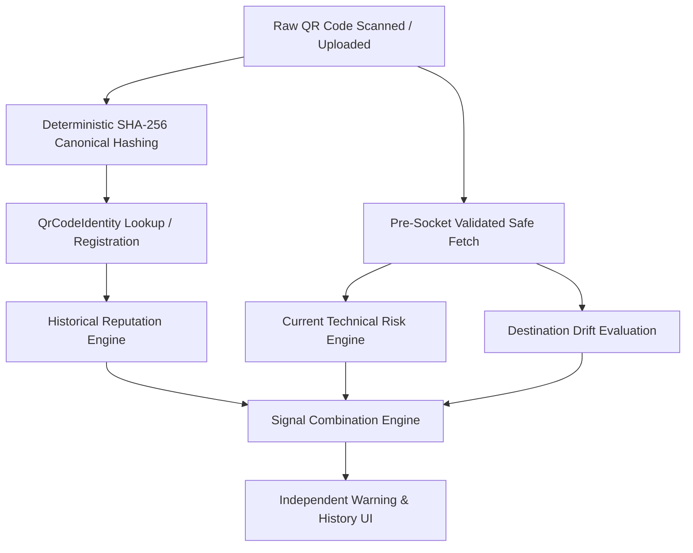

# QRGuard — Persistent QR Reputation & Destination Intelligence Architecture

QRGuard delivers persistent identity tracking, historical threat intelligence, and destination drift analysis for physical and digital QR codes.

---

## 1. Core Architecture

Unlike conventional QR readers that discard context after decoding a string, QRGuard maintains a **persistent security memory** across all scans, observations, and community telemetry.



---

## 2. QR Identity & Deterministic Fingerprinting

Every QR payload is canonically normalized and hashed using SHA-256:

$$\text{Fingerprint} = \text{SHA-256}(\text{Canonicalize}(\text{Payload}))$$

* **Canonicalization Rules:**
  * Lowercases hostnames and scheme protocols.
  * Strips default explicit ports (`:80` for HTTP, `:443` for HTTPS).
  * Cleans redundant trailing slashes on domain roots while preserving nested paths and search query parameters.
  * Normalizes specialized prefixes (`mailto:`, `tel:`, `upi://`).

This ensures repeat scans of the exact same physical QR code are recognized across time even if the underlying web destination changed.

---

## 3. Destination Drift Detection

For every QR scan, QRGuard queries historical observations and classifies runtime behavior:

| Change Classification | Description | Destination Changed? |
| :--- | :--- | :--- |
| `FIRST_OBSERVATION` | Initial recording of this QR payload in QRGuard. | `false` |
| `NO_CHANGE` | Matches previously observed endpoint and redirect hops. | `false` |
| `FINAL_DESTINATION_CHANGED` | Target path or query parameter shifted. | `true` |
| `DOMAIN_CHANGED` | Target hostname shifted to a new domain. | `true` |
| `SCHEME_CHANGED` | Protocol downgraded (e.g. HTTPS $\to$ HTTP). | `true` |
| `PORT_CHANGED` | Target network port changed. | `true` |
| `REDIRECT_CHAIN_CHANGED` | Intermediate redirect hops changed. | `true` |
| `BLOCKED_DESTINATION` | Pre-socket SSRF / Private loopback blocked. | `true` |

---

## 4. Persistent Reputation & Severity Scoring

Reputation is deterministically derived from verified community reports, moderation statuses, and severity weights:

* **Category Weights:**
  * `PHISHING`, `FAKE_PAYMENT`, `MALWARE`: Weight 35
  * `FAKE_LOGIN`: Weight 30
  * `IMPERSONATION`, `SCAM`: Weight 25
  * `SUSPICIOUS_REDIRECT`, `DESTINATION_CHANGED`: Weight 20
  * `OTHER`: Weight 10
* **Moderation Multiplier:** Confirmed reports receive a $1.5\times$ multiplier.
* **Permanent Critical Severity (`hasCriticalHistory`):** Once a QR code is confirmed for high-severity threats, it permanently retains high historical vigilance regardless of whether its current target is swapped.

---

## 5. Intelligence Scenarios (A through G)

QRGuard clearly distinguishes between **historical reputation** and **current technical analysis**:

```
+-------------------------------------------------------------------------+
| SCENARIO A: 🆕 First Observation                                       |
| - QR code has not been observed by QRGuard before.                      |
| - Current destination evaluated on technical merit.                     |
+-------------------------------------------------------------------------+
| SCENARIO B: 🟢 Destination Unchanged                                   |
| - QR code is pointing to the same destination previously observed.     |
| - Verified safe destination eligible for gateway auto-open.             |
+-------------------------------------------------------------------------+
| SCENARIO C: 🔴 Community Warning (Previously Reported)                  |
| - QR code has prior verified reports in community telemetry.            |
| - Explicit user confirmation modal required before proceeding.          |
+-------------------------------------------------------------------------+
| SCENARIO D: ⛔ Previously Identified as Critical                        |
| - QR code was previously classified as CRITICAL / Malware / Fraud.      |
| - Historical severity permanently maintained.                           |
+-------------------------------------------------------------------------+
| SCENARIO E: 🚨 Community Warning + ⚠️ Destination Changed               |
| - QR code was previously reported AND its destination URL shifted.      |
| - Dual warning displayed: community flag + drift alert.                |
+-------------------------------------------------------------------------+
| SCENARIO F: ⚠️ Destination Changed (No Reports)                         |
| - Destination shifted from previous target without community reports.   |
| - Prompts caution to verify whether change is legitimate.               |
+-------------------------------------------------------------------------+
| SCENARIO G: 🟡 Historical Warning + 🟢 Current Safe                     |
| - QR previously reported, but current technical endpoint is clean.      |
| - Signals remain separated; user alerted to past history.              |
+-------------------------------------------------------------------------+
```

---

## 6. Verification & Automated Test Coverage

The test suite in [`backend/tests/security/qrReputation.test.ts`](file:///c:/Users/antho/.gemini/antigravity-ide/scratch/qrguard/backend/tests/security/qrReputation.test.ts) covers all 20 scenarios:
* Canonical URL normalization
* SHA-256 fingerprint determinism
* Scan count persistence
* All drift classifications (First observation, No change, Path drift, Domain drift, SSL downgrade, Hop drift)
* Diminishing returns reputation scoring & Critical escalation
* Scenarios A, B, C, D, E, F, G combination logic
* Zero-PII / IDOR historical telemetry retrieval
